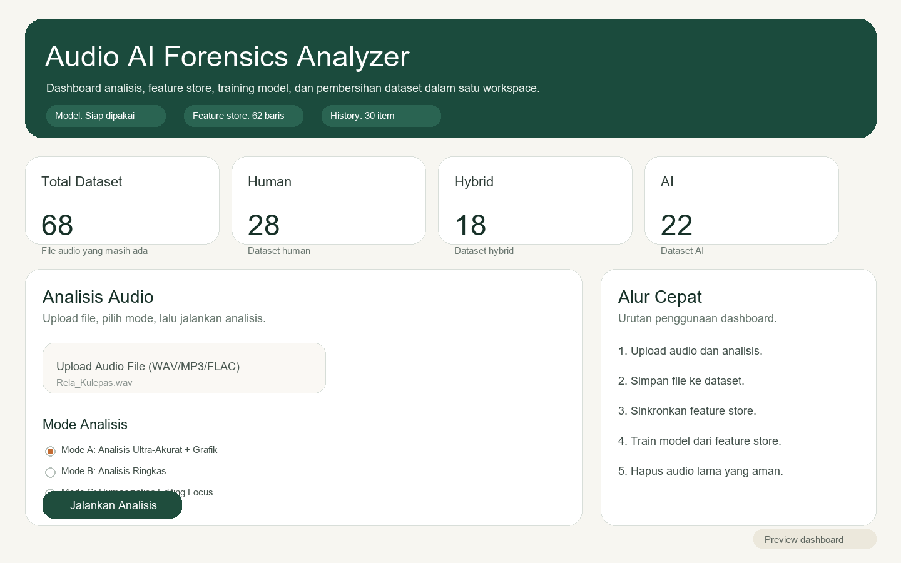

# Audio AI Forensics Analyzer

Dashboard lokal untuk analisis audio `Human / Hybrid / AI`, manajemen dataset, sinkronisasi feature store, dan retraining model.

## Tampilan Dashboard

Preview dashboard utama:



Tampilan ini menunjukkan layout utama aplikasi, termasuk area analisis audio, hasil forensik, workflow dataset, dan panel training.

## Gambaran Umum

Project ini dirancang untuk workflow harian yang praktis:
- analisis file audio dari dashboard
- baca hasil forensik dan penjelasan awam
- simpan file yang sudah diberi label ke dataset
- sinkronkan feature store agar audio lama tidak wajib disimpan
- train ulang model langsung dari dashboard

Project ini cocok dipakai saat kamu ingin:
- screening audio secara cepat
- membangun dataset training bertahap
- menjaga model tetap belajar dari data lama tanpa memenuhi storage

## Panduan Belajar

Untuk versi pembelajaran yang lebih sederhana dan ramah untuk siswa SMA, baca:

- [BUKU_PANDUAN_SISWA_SMA.md](D:/My%20Project/Audio_Analyzer/BUKU_PANDUAN_SISWA_SMA.md)

## Fitur Utama

- Analisis audio upload dengan 3 mode:
  - `Mode A`: analisis lengkap + grafik
  - `Mode B`: analisis ringkas
  - `Mode C`: fokus humanization / perbaikan
- Hasil akhir yang dipisah antara:
  - `Forensic decision`
  - `Prediksi ML`
  - `Evidence Card`
  - `Fingerprint Module`
- History analisis yang bisa dibuka lagi
- Penyimpanan file ke dataset:
  - `Human`
  - `Hybrid`
  - `AI`
- Feature store untuk menyimpan fitur numerik hasil training
- Retrain model dari feature store
- Progress visual untuk:
  - analisis audio
  - sinkronisasi feature store
- Tombol aman untuk menghapus audio lama yang sudah tersimpan di feature store
- Launcher `.exe` untuk buka dan stop app tanpa terminal

## Struktur File Penting

### Aplikasi

- `app.py`
  Dashboard Streamlit utama dan source of truth tampilan aplikasi.
- `analyzer_ml.py`
  Mesin analisis audio dan kebijakan screening.
- `ml_pipeline.py`
  Logic training model, feature store, dan prediksi.
- `models.py`
  Struktur data hasil analisis.

Catatan:
- jalankan dashboard dari `app.py`
- file kompatibilitas lama tidak dipakai sebagai entry point utama

### Training

- `train_model.py`
  Script training manual dari terminal.
- `dataset.csv`
  Index dataset audio.
- `training_features.csv`
  Feature store. Menyimpan fitur numerik audio yang pernah diproses untuk training.

### Dataset

- `data/human`
- `data/hybrid`
- `data/ai`

Folder ini menyimpan file audio mentah yang dipakai sebagai dataset.

### Launcher

- `AudioAIForensicsLauncher.exe`
  Menjalankan app dan membuka browser.
- `AudioAIForensicsStop.exe`
  Menghentikan server app.

## Cara Menjalankan App

### Opsi 1: Paling Praktis

Double click:
- `AudioAIForensicsLauncher.exe`

Launcher akan:
- menjalankan Streamlit di background
- membuka browser otomatis ke `http://127.0.0.1:8501`
- tidak menampilkan terminal yang mengganggu pekerjaan lain

Untuk menghentikan app:
- double click `AudioAIForensicsStop.exe`

### Opsi 2: Manual Dari Terminal

Jalankan dari folder project:

```powershell
& '.\.venv\Scripts\python.exe' -m streamlit run app.py
```

## Deploy Online Demo

Project ini sekarang juga mendukung **mode online demo** yang lebih aman untuk publik.

Mode ini cocok jika kamu ingin:
- membagikan analisis ke orang lain lewat browser
- menyembunyikan fitur admin seperti training dan dataset
- menjaga versi publik tetap sederhana

File panduan deploy:

- [DEPLOY_ONLINE_DEMO.md](D:/My%20Project/Audio_Analyzer/DEPLOY_ONLINE_DEMO.md)

Ringkasnya:
- deploy `app.py`
- sediakan `model.joblib`
- aktifkan flag `AUDIO_ANALYZER_DEMO_MODE=1`

Saat mode demo aktif:
- tab `Training & Dataset` disembunyikan
- tab `History` disembunyikan
- tombol simpan ke dataset tidak tampil
- halaman publik fokus ke upload + analisis + penjelasan hasil

Lalu buka:

```text
http://127.0.0.1:8501
```

## Cara Pakai Dashboard

### 1. Analisis Audio

1. Upload file audio.
2. Pilih mode analisis.
3. Klik `Jalankan Analisis`.
4. Tunggu progress selesai.
5. Baca hasil utama di panel atas.

### 2. Memahami Hasil

Bagian terpenting:

- `Forensic decision`
  Keputusan utama sistem:
  - `PASS`
  - `REVIEW`
  - `FAIL`
- `Prediksi ML`
  Kecenderungan model ML. Ini bukan keputusan final.
- `Verdict probabilities`
  Distribusi skor yang dipakai untuk headline.
- `Evidence Card`
  Ringkasan strong evidence, weak/context evidence, dan production-mimic indicators.
- `Bahasa Sederhana`
  Penjelasan awam supaya hasil lebih mudah dipahami.

## Menambahkan File ke Dataset

Setelah analisis selesai, akan muncul tombol:
- `Tambahkan ke Dataset Human`
- `Tambahkan ke Dataset Hybrid`
- `Tambahkan ke Dataset AI`

Alurnya:
1. analisis file dulu
2. pilih label yang benar
3. file disalin ke folder dataset yang sesuai
4. `dataset.csv` diperbarui
5. fitur numeriknya juga masuk ke `training_features.csv`

Catatan:
- jangan masukkan file ke dataset hanya berdasarkan tebakan model
- pastikan label memang sudah kamu yakin benar

## Feature Store

Feature store ada di:

```text
training_features.csv
```

Fungsinya:
- menyimpan fitur numerik dari audio yang pernah disinkronkan atau ditambahkan
- memungkinkan retrain model tanpa membaca ulang semua audio lama
- membuat audio lama bisa dihapus setelah fiturnya aman

Dengan kata lain:
- `model lama tidak bergantung ke file audio lama`
- selama fitur numeriknya sudah ada di feature store, data pengetahuannya tetap aman

## Sinkronkan Feature Store Dari Dataset Lama

Gunakan tombol:

```text
Sinkronkan Feature Store dari Dataset Lama
```

Fungsinya:
- membaca semua file di folder `data`
- mengekstrak fitur satu per satu
- menyimpan hasilnya ke `training_features.csv`

Saat proses berjalan, dashboard akan menampilkan:
- persentase
- file ke berapa dari total
- jumlah berhasil
- jumlah skipped
- nama file yang sedang diproses

Jika ada file gagal dibaca:
- file masuk daftar `skipped`
- dashboard menampilkan nama file dan alasannya
- file seperti ini biasanya perlu dikonversi ke `WAV`

## Training Ulang Model

### Lewat Dashboard

Di panel `Training & Dataset`:
1. pastikan feature store sudah terisi
2. klik `Train Model dari feature store`
3. tunggu sampai selesai

### Lewat Terminal

```powershell
& '.\.venv\Scripts\python.exe' train_model.py --dataset .\dataset.csv --feature-store .\training_features.csv --output .\model.joblib
```

Hasil training akan disimpan ke:

```text
model.joblib
```

## Menghapus Audio Lama Dengan Aman

Setelah feature store terisi, dashboard akan membagi file menjadi:
- `Aman dihapus`
- `Belum aman`
- `Skipped`

Gunakan tombol:

```text
Hapus Audio Lama yang Sudah Aman
```

File aman dihapus jika:
- file masih ada di folder `data`
- dan path-nya sudah tercatat di `training_features.csv`

File `skipped`:
- jangan dihapus dulu kalau kamu masih ingin menyelamatkan datanya
- lebih baik dikonversi ke `WAV`, lalu sinkron ulang

## Jika Menghapus File Manual

Kalau kamu menghapus audio langsung dari folder `data`, gunakan:

```text
Refresh Dataset Index
```

Supaya:
- `dataset.csv` sinkron lagi
- angka di dashboard ikut diperbarui

Kalau status skipped belum berubah, gunakan:

```text
Refresh Status File Skipped
```

## File Bermasalah / Skipped

Kalau sinkron menampilkan file `skipped`, penyebab umumnya:
- file MP3 rusak
- header audio tidak valid
- file MP4/video tidak cocok dibaca pipeline
- codec tidak bersih

Solusi paling aman:
1. konversi file itu ke `WAV`
2. simpan hasil konversi ke folder dataset yang benar
3. sinkron ulang feature store

## Workflow Harian yang Disarankan

1. Jalankan app lewat `AudioAIForensicsLauncher.exe`
2. Upload audio dan analisis
3. Kalau labelnya sudah yakin, simpan ke dataset
4. Setelah beberapa file baru masuk, train ulang model dari feature store
5. Kalau feature store sudah aman, hapus audio lama yang aman dihapus
6. Gunakan `AudioAIForensicsStop.exe` saat selesai

## Catatan Penting

- `Prediksi ML` bukan keputusan final.
- `Forensic decision` adalah keputusan utama sistem.
- Feature store lebih penting untuk retraining jangka panjang daripada menyimpan semua audio lama.
- Audio yang belum pernah masuk ke feature store sebaiknya jangan dihapus dulu.
- File `skipped` tidak ikut masuk ke model sampai berhasil dibaca dan disinkronkan.

## Troubleshooting

### App tidak terbuka

Coba:
- jalankan `AudioAIForensicsLauncher.exe` lagi
- atau buka `http://127.0.0.1:8501`

### App masih terasa berjalan

Klik:
- `AudioAIForensicsStop.exe`

### Training gagal

Cek:
- apakah `training_features.csv` sudah ada
- apakah tiap kelas punya cukup sampel
- apakah ada file dataset yang rusak

### Sinkron lama sekali

Ini normal kalau:
- jumlah file banyak
- durasi lagu panjang
- CPU sedang sibuk

Gunakan progress yang ada di dashboard untuk memastikan proses masih berjalan.
